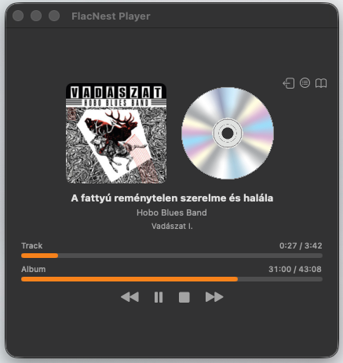

# FlacNest

A native macOS app for playing FLAC albums with CUE sheets. FlacNest scans a folder of music, builds a library from your CUE files, and gives you a focused player for gapless album playback—with optional library management, metadata editing, and menu bar controls.



## Goals

FlacNest is built for listening to **single-file FLAC rips split by CUE sheets**—the kind of library many audiophile collections use, without converting files or splitting tracks on disk. The app aims to:

- Play albums accurately using **CUE track boundaries** (INDEX 01), not arbitrary file splits
- Keep your files **where they are**—scan a folder, play from the original paths
- Offer a **simple, native macOS experience**: separate player and library windows, keyboard shortcuts, media keys, and an optional menu bar controller
- Persist **library metadata and playback state** between launches

## How It Works

### Library

1. Choose a **library home folder** in Settings. FlacNest scans it for `.cue` files and their companion `.flac` files.
2. Album and track info is stored in **`flacnest.xml`** (by default inside the library folder, or in a custom location you choose).
3. Open **FlacNest Library** to browse albums, sort/group the list, refresh after adding new music, and edit album metadata or artwork.

Double-click an album to start playback. You can also use the mini player strip at the bottom of the library when the main player window is closed.

### Player

**FlacNest Player** shows album art, an optional spinning CD, track and album progress bars (with seek), and transport controls. You can:

- **Attach / detach** the player from the library—detach opens the standalone player; attach closes it and brings the library forward with the mini player
- Toggle a **track list** for the current album (window size is remembered separately for compact and expanded layouts)
- Control playback via **keyboard shortcuts**, **media keys**, or the optional **status menu**

### Playback

- One FLAC file per album; tracks are defined by the CUE sheet
- Auto-advance at track boundaries; previous/next track and seek within the album
- Optional **resume last album and position** on launch
- **Now Playing** info for system media controls when an album is loaded

### Settings

- Library folder and optional custom `flacnest.xml` location
- Theme: System, Light, or Dark
- Save last played position, spinning CD, status menu toggle
- Player window sizes are saved per layout (mini vs. track list open)

## Requirements

- **macOS 14** or later
- FLAC files with accompanying CUE sheets in your library folder

## Keyboard Shortcuts

| Action | Shortcut |
|--------|----------|
| Play / Pause | Space |
| Stop | ⌘. |
| Next track | ⌘→ |
| Previous track | ⌘← |
| FlacNest Player | ⌘1 |
| FlacNest Library | ⌘2 |
| Play selected album (library) | Return |
| Edit metadata (library) | ⌘E |
| Refresh library | ⌘R |


## Project Structure

```
FlacNest/
├── FlacNest/           # App source (SwiftUI views, playback, library scanner)
├── FlacNest.xcodeproj/
└── Images/             # Design assets (ignored by git)
```

Open `FlacNest.xcodeproj` in Xcode to build and run.

## Attributions

- Portions of this project were written and refined with [Cursor](https://cursor.sh), an AI-powered code editor.
- UI imagery includes assets from [Vecteezy.com](https://www.vecteezy.com).
